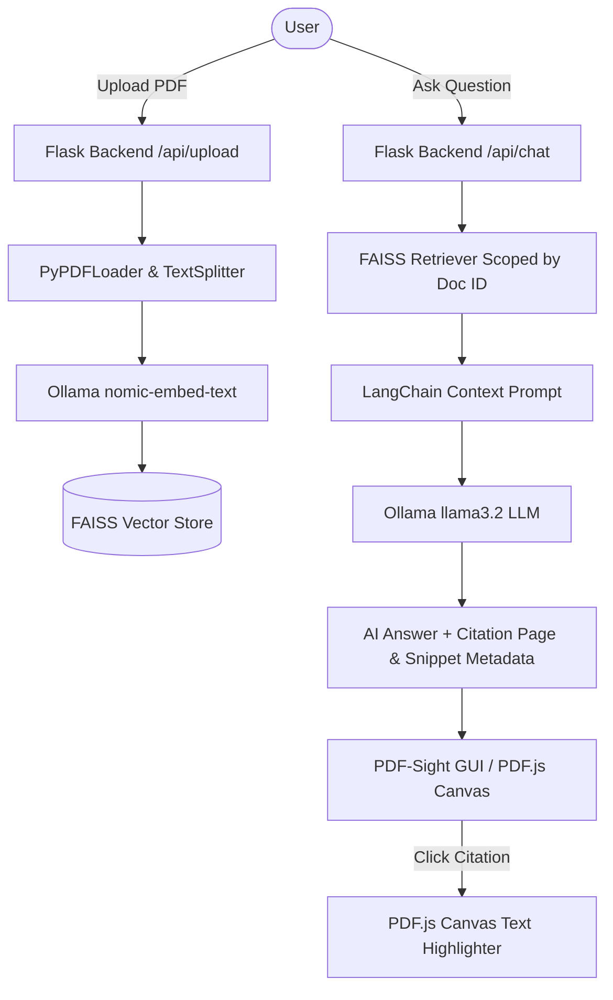

# 🧠 PDF-Sight — Local Multi-PDF RAG Assistant

[](https://www.python.org/)
[](https://flask.palletsprojects.com/)
[](https://www.langchain.com/)
[](https://github.com/facebookresearch/faiss)
[](https://ollama.ai/)
[](LICENSE)
[](https://your-deployment-link-here.com)

**PDF-Sight** is a privacy-first, local multi-document Retrieval-Augmented Generation (RAG) assistant. Built with **Flask**, **LangChain**, **FAISS**, **PDF.js**, and **Ollama**, PDF-Sight turns your local PDF library into an interactive, conversational knowledge base with page-level citation jump-badges, canvas text highlighting, dark mode inversion, report exporting, and document management.

> 🌐 **Live Application**: [https://your-deployment-link-here.com](https://your-deployment-link-here.com) *(Update this URL once hosted)*

---

## 🌟 Key Features & Roadmap

### ⚡ Smart Document Intelligence & RAG Engine
- **Multi-PDF Library Indexing**: Upload and index multiple PDF files simultaneously into a high-density FAISS vector store.
- **Target Context Filtering**: Switch search scoping between `🌐 All Indexed Documents` or target specific files.
- **Interactive Citation Badges**: Click any citation badge in the AI responses to switch the viewer and jump to the exact source page.
- **Text Highlighting on PDF Canvas**: Clicking citation badges computes text bounding coordinates (`pdfjsLib.Util.transform`) and overlays translucent yellow highlight boxes over matching text snippets directly on top of the rendered PDF page.
- **100% Local & Private**: Powered by **Ollama** (`llama3.2` & `nomic-embed-text`) — zero API keys required and 100% of your data stays on your machine.

### 🎨 Commercial-Grade UI / UX
- **Dark / Night Mode PDF Inversion**: 1-click toggle (<i class="fa-solid fa-moon"></i>) to invert PDF canvas colors (`filter: invert(0.92) hue-rotate(180deg)`) with clean drop-shadow framing for eye-comfort night reading.
- **Export Chat & Analysis Report**: 1-click export button (<i class="fa-solid fa-file-export"></i>) to compile full conversation logs, active target context, and cited source references into a downloadable `.md` report.
- **Interactive Page Jump Input Box**: Interactive numeric input field (`Page [ 24 ] of 51`). Type any page number and hit `Enter` to jump instantly.
- **Indexed Document Manager Modal**: Management popup modal (<i class="fa-solid fa-folder-open"></i>) listing all indexed PDFs with individual **Delete** buttons to purge specific files from the FAISS vector store.
- **Draggable Split-Panel Resizer**: Drag the central divider bar to adjust chat and PDF viewer panel widths in real-time with min-width (320px) boundary protection.
- **Collapsible Sidebar**: One-click toggle to collapse the chat panel into a full-screen 100% width PDF viewer.
- **High-Resolution Zoom & Drag-to-Pan (Grab View)**: Multi-page rendering with page controls, zoom scaling up to 500%, live zoom percentage display, 1-click zoom reset, and click-and-drag mouse panning (`cursor: grab / grabbing`).
- **Safe Center Layout Engine**: Automatically centers pages when fitted, and preserves equal 4-side dark margins during zoom overflow via `safe center` flex layout and `::after` scroll spacers.

---

## 🛠️ Technology Stack

| Layer | Technology | Purpose |
| :--- | :--- | :--- |
| **Backend Framework** | [Flask](https://flask.palletsprojects.com/) | REST API routes for uploads, chat streams, document deletion, and report exports |
| **RAG Orchestration** | [LangChain](https://www.langchain.com/) | Document loading (`PyPDFLoader`), chunking (`RecursiveCharacterTextSplitter`), and prompt chaining |
| **Vector Database** | [FAISS](https://github.com/facebookresearch/faiss) | High-performance in-memory similarity search and embedding storage |
| **Local LLM & Embeddings** | [Ollama](https://ollama.ai/) | `llama3.2` (Chat LLM) & `nomic-embed-text` (Document Vector Embeddings) |
| **Frontend Viewer** | [PDF.js](https://mozilla.github.io/pdf.js/) | Hardware-accelerated HTML5 canvas rendering & text content matrix extraction |
| **Styling & Logic** | HTML5, Vanilla CSS3, JavaScript (ES6+) | Resizable split layout, draggable handle, night mode filter, modal dialog, and report generator |

---

## 🏗️ Architecture Overview



---

## 🚀 Quickstart Guide

### 1. Prerequisites
- **Python**: Version `3.10` or higher installed.
- **Ollama**: Download and install [Ollama](https://ollama.ai/).

Pull the required local LLM and embedding models:
```bash
ollama pull llama3.2
ollama pull nomic-embed-text
```

---

### 2. Installation & Setup

1. **Clone the repository**:
   ```bash
   git clone https://github.com/Eman-Nadeem/pdf-sight-langchain-rag.git
   cd pdf-sight-langchain-rag
   ```

2. **Create and activate a Python virtual environment**:
   ```bash
   # Windows (PowerShell)
   python -m venv venv
   .\venv\Scripts\Activate.ps1

   # macOS / Linux
   python3 -m venv venv
   source venv/bin/activate
   ```

3. **Install dependencies**:
   ```bash
   pip install -r requirements.txt
   ```

4. **Configure Environment Variables**:
   Create a `.env` file in the root directory (or use the included defaults):
   ```env
   # Model Provider: "ollama", "openai", or "gemini"
   MODEL_PROVIDER=ollama

   # Local Ollama Configuration
   OLLAMA_BASE_URL=http://localhost:11434
   OLLAMA_MODEL=llama3.2
   OLLAMA_EMBED_MODEL=nomic-embed-text

   # Cloud Providers (Optional)
   OPENAI_API_KEY=your-openai-api-key-here
   OPENAI_MODEL=gpt-4o-mini
   OPENAI_EMBED_MODEL=text-embedding-3-small

   GOOGLE_API_KEY=your-google-gemini-api-key-here
   GEMINI_MODEL=gemini-1.5-flash
   ```

---

### 3. Running the Application

Launch the Flask server:
```bash
python app.py
```

Open your browser and navigate to:
```text
http://127.0.0.1:5000
```

---

## 📁 Directory Structure

```text
pdf-sight/
├── app.py                  # Flask server application & REST API endpoints
├── rag_engine.py           # LangChain RAG pipeline & FAISS vector store integration
├── requirements.txt        # Python package dependencies
├── .env                    # Environment configuration file
├── uploads/                # Uploaded PDF document storage
├── static/
│   ├── css/
│   │   └── style.css       # Layout tokens, resizer bar, night mode & modal styles
│   └── js/
│       ├── chat.js         # Chat UI, upload handler, resizer, report export & modal logic
│       └── pdf_viewer.js   # PDF.js render pipeline, canvas highlighter, zoom & panning
└── templates/
    └── index.html          # Main split-panel application view & modal markup
```

---

## ⚡ Switching Model Providers

PDF-Sight natively supports switching between local Ollama and cloud providers like OpenAI or Google Gemini.

To switch providers, update your `.env` file:
```env
# Switch to OpenAI
MODEL_PROVIDER=openai
OPENAI_API_KEY=sk-...

# Or Switch to Gemini
MODEL_PROVIDER=gemini
GOOGLE_API_KEY=AIzaSy...
```

---

## 🤝 Contributing

Contributions, issues, and feature requests are welcome!
1. Fork the Project
2. Create your Feature Branch (`git checkout -b feature/AmazingFeature`)
3. Commit your Changes (`git commit -m 'Add some AmazingFeature'`)
4. Push to the Branch (`git checkout -b feature/AmazingFeature`)
5. Open a Pull Request

---

## 📄 License

Distributed under the **MIT License**. See `LICENSE` for more information.

---

## 👩‍💻 Author & Connect

**Eman Nadeem**
- **LinkedIn**: [emaan-nadeem](https://www.linkedin.com/in/emaan-nadeem)
- **GitHub**: [@Eman-Nadeem](https://github.com/Eman-Nadeem)

---
*Created with ❤️ by Eman Nadeem*
